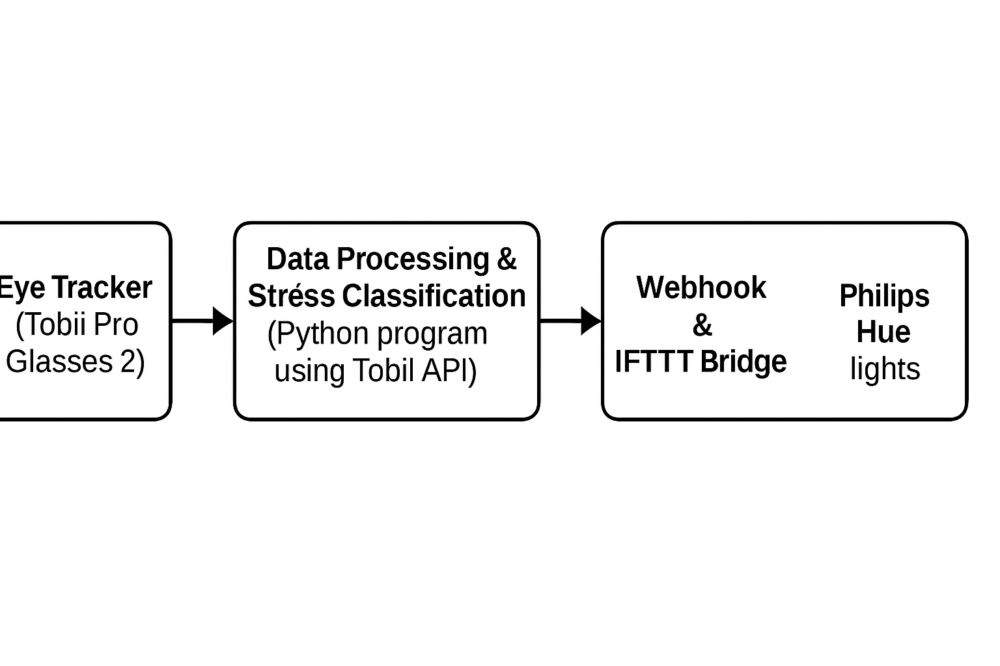

# Eye-tracking to Optimize Lighting for Stress Management

This project explores how **eye-tracking** and **smart lighting** can work together to imptove mental well-being. It was developed as part of the M7012E Pervasive Computing course and addresses the problem of stress and anxiety in smart-home environments. A system was built that monitors a user's eye movements in real time and automatically adapts ambient lighting to help calm the user. A demonstration of the prototype is available early on in this document to provide a quick visual overview of the system.

👉 [Watch the demonstration](https://youtu.be/3w56A3nOxEE)

## Overview

Modern smart-homes can incorporate **Intenet of Things (IoT)** devices and sensors to create responsive enviornments. Research has shown that eye movements (blink rate, gaze direction and pupil dilation) provide clues about a person's emotional state. Other studies have found that exposure to certain light colors can reduce stress and anxiety. By combining these findings, our team set out to build a prototype that continuously measures eye movements and uses the results to adjust lighting in order to manage stress. The system works without direct user interaction; it observes, classifies stress, then triggers the smart lights accordingly.

## Project Description

At a high level, the system comprises an **eye-tracking device** (Tobii Pro Glasses 2), a **data processing layer** running a Python program and a **smart-lighting controlelr** using Philips Hue bulbs. The program streams gaze data from the glasses, classifies stress level based on teh number and movement of gaze points in a shor titme window, and fires a JSON webhook using the IFTTT service to change the colour of the ambient lights. Time of day is also considered; during daytime the default colour is whilte and during night time it is yelloe. When stress is detected, the colour changes to pastel blue (high stress) or pink (medium stress). The system thus is able to adapt to help users feel calmer and reduce anxiety via via subtle adjustments to the environment in repsonse to their state.

The prototype was built by **Vaishob Anand, Hongpo Chen and Benjamin Ong** under the supervision of **Kåre Synnes**. Although time constraints limited rigorous data collection, the team successfully developed a working proof-of-concept.

## Architecture

The system follows a simple data-flow architecture: data from the eye tracker is processed on a computer, classified into stress levels, and then used to control the lights via a web service. The following flowchart illustrates the main components and their relationships:

**1. Eye Tracker (Tobii Pro Glasses 2)** - captures the user's gaze data (x-y coordinates, blink rate and pupil size).

**2. Data Processing & Stress Classification** - a Python program uses the Tobii API to stream gaze points, stores them in a queue, and evaluates changes over time to classify stress levels (SleepingTime, Low, Medium or High). If eye movement exceeds a threshold, the queue records a count and triggers a stress level update.

**3. Webhook & IFTTT Bridge** - when stress is detected, the program constructs a URL for an IFTTT webhook event corresponding to the stress level and sends a request to IFTTT. IFTTT, in turn, interfaces with Philips Hue to change lighting.

**4. Philips Hue Smart Lights** - two Hue bulbs connected via the Hue bridge receive commands to change colour. During the day, the default light is white; at night, it is yellow; high stress triggers pastel blue; medium stress triggers pink.

| Component               | Purpose/Role                                                                     |
| ----------------------- | -------------------------------------------------------------------------------- |
| **Tobii Pro Glasses 2** | Captures gaze data (position and pupil movement)                                 |
| **Python + Tobii API**  | Streams gaze data, calculates stress levels, triggers webhooks                   |
| **Philips Hue bulbs**   | Provides ambient lighting; colour changes based on stress level                  |
| **Hue Bridge / IFTTT**  | Receives webhook requests and communicates with the Hue bulbs to adjust lighting |

## Methodology
### Participants
The project team members acted as participants - three males aged 22-24 with normal or corrected vision and no history of neurological or psychiatric disorders. Due to limited time, no external participants were recruited; instead, the focus was on building and testing the prototype.

### Apparatus & Setup
- **Calibration:** Before each session, participants wore the Tobii pro glasses and looked at a calibration card so the program could accurately map gaze coordinates.
- **Data capture:** The glasses streamed gaze data (x-y coordinates and pupil dilation) to a laptio via the Tobii API. A live video allowed the program to overlay gaze points on the frame.
- **Lighting:** Two Philips Hue bulbs connected to a Hue bridge were used to provide ambient lighting. The bulbs were registered with a Philips account and controled via the IFTTT web service.

### Procedure & Algorithm
The system runs in a continuous loop:

**1. Collect gaze points** - Gaze coordinates are read from the Tobii API and appended to a queue. The program counts the number of significant changes (eye movements) within a sliding time window.

**2. Classify stress level** - If the queue records few changes, the user is considered to be in a resting state or sleeping (SleepingTime). More frequent movements correspond to low, medium or high stress levels. The thresholds were determined heuristically during testing.

**3. Adjust lighting** - When a stress threshold is crossed, the program checks the current time to decide whether the default colour should be white (day) or yellow (night). It then fires an IFTTT webhook event corresponding to the detected stress level. The Hue bulbs respond by changing to pastel blue for high stress or pink for medium stress.

**4. Loop** - The loop continues until the user stops the program. Video frames and gaze data continue to be processed, and stress levels are updated dynamically.

 
 ## Stress Levels & Lighting Responses
 The relationship between stress classification and lighting colour is summarised below. Note that the exact thresholds were chosed based on preliminary experiments and literature on colour psychology.

 | Stress Level      | Condition (simplified)     | Lighting Colour                    | Rationale                                                                              |
| ----------------- | -------------------------- | ---------------------------------- | -------------------------------------------------------------------------------------- |
| **SleepingTime**  | Minimal or no eye movement | Off or dim yellow                  | Avoid disturbing sleep                                                                 |
| **Low Stress**    | Few gaze point changes     | White (day) or soft yellow (night) | Maintain neutral ambience                                                              |
| **Medium Stress** | Moderate eye movement      | Pink                               | Studies report pink has calming effects, suitable for moderate stress                  |
| **High Stress**   | Many erratic eye movements | Pastel blue                        | Blue has strong calming properties but may affect sleep; used only when stress is high |

## Usage Guide
To experiment with the prototype yourself, follow these steps:

**1. Hardware setup:** Acquire Tobii Pro Glasses 2 and Philips Hue bulbs (with a Hue bridge). Create a Philips account and register the bulbs. Set up an IFTTT account and configure four webhook events corresponding to the stress levels (e.g. `SleepingTime`, `LowLevelStress`, `MediumLevelStress`, `HighLevelStress`). Each IFTTT applet should change the Hue bulbs to the desired colour.

**2. Software installation:** Clone the project repository from GitHub (`https://github.com/vaishob/m7012e`) and install dependencies (`tobii_research`, `opencv-python`, `numpy`, etc.).

**3. Run the script:** Connect the Tobii glasses to your computer. Launch the Python program (`main.py` in the repository). The program will calibrate the glasses, begin streaming gaze data and print the current stress level along with the time and IFTTT URL in the console.

**4. Test:** Observe the Hue bulbs as you move your eyes. During the day the lights start white, while at night they are yellow. Quick, erratic movements should cause the lights to change to pastel blue (high stress), whereas moderate movements trigger pink (medium stress). If you remain still, the lights return to their default state.

**5. Stop:** Exit the program (e.g. press `q` in the video window). The connection to the glasses and IFTTT will be closed gracefully.
 

 ## Results
 Although the team did not conduct a formal user study due to time constraints, informal trials demonstrated the concept's viability. When high stress levels were simulated during the day, the system fired a webhook that turned the lights pastel blue, and participants reported feeling calmer. During night-time tests, medium stress triggered a pink light, which participants said helped them relax and fall asleep easier. These results suggest that responsive lighting based on eye-tracking may have a positive effect on stress management, though more rigorous testing is needed.

 ## Challenges and Lessons Learned
 The team faced several challenges while developing the system:
 * **Detecting stress accurately:** Deciding how many gaze changes constitute a certain stress level was non-trivial. The team used a queue data structure to store recent gaze points and considered the frequency of changes to classify stress.
 * **Choosing calming colours:** Research suggested that blue and pink have calming effects, but blue can also delay sleep onset. The team therefore reserved pastel blue for high stress and used pink for medium stress. Future work could investigate more precise shades and include user personalisation.
 * **Hardware troubleshooting:** Some problems were caused by hardware rather than code; for example, low battery in the glasses led to erratic data. The lesson was to check physical components before debugging software.
 * **Information overload:** The initial dataset from the eye tracker contained many parameters. Focusing on a small set of relevant metrics (e.g. gaze position) simplified development and improved clarity.

## Limitations & Future Work
The current prototype demonstrates a proof-of-ceoncept, but there are several limitations:
 * **Limited sample size:** Only three participants were involved, all of whom were members of the project team. A larger and more diverse sample is needed to validate the stress-classification algorithm.
 * **Colour research:** The choice of colours (pink and blue) was based on general literature but not verified with rigorous experiments. Future iterations could experiment with different hues and intensities.
 * **Additional sensors:** Eye-tracking alone may not capture all aspects of stress. Combining the system with heart rate, breathing rate or skin conductance sensors could improve acccuracy.
 * **Multiple lights:** Future versions might use a system of lights - different bulbs for sleep lighting versus general ambient lighting - to better separate functions.

## Repository & Contributions
The full source code, including the Python scripts and setup instruction, is hosted on GitHub: [vaishob/m7012e](https://github.com/vaishob/m7012e). Contributions are welcome! Please open issues or pull requests to suggest improvments, report bugs or propose new features.

## Credits & Acknowledgements
This project was completed by **Vaishob Anand, Hongpo Chen and Benjamin Ong** as part of the **M7012E Pervasive Computing** course at Luleå University of Technology. The team is grateful for the guidance of **Kåre Synnes** and acknowledges the work of researchers whose studies informed the design - particularly studies on eye-tracking metrics and the role of colours in stress reduction.

## 

_For more detailed technical documentation, including code comments and class diagrams, please refer to the project report and documentation provided in this repository. The README serves as a high‑level overview and entry point to the project._
